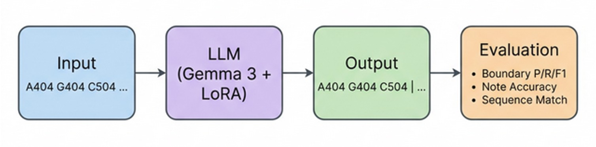

# 音樂樂句邊界預測 — Phrase Boundary Prediction

使用微調後的大型語言模型 (LLM)，自動在 Bach 聖詠曲的音符序列中標記**樂句邊界**。

> **Scope**: This repository focuses on **evaluation and a minimal demo** for boundary-token insertion. Training code and annotated data are thesis-related and available upon request.

---

## 任務定義

給定一段音符序列，模型需要在判斷為斷句位置的位置插入 `|` 標記來標示樂句邊界，**且不能改動任何音符 token**

```
Input:  A404 G404 C504 a402 d404 F402 G404 g402 a404 G404 d402 ...
Output: A404 G404 C504 a402 | d404 F402 G404 g402 a404 G404 d402 | ...
                            ↑                                    ↑
                     phrase boundary                         phrase boundary
```

---

## 音符表示法 (YNote)

每個音符是一個 **4 字元 token**：`[音高 2 字元][時值 2 字元]`

```
C504  →  C5 (音高) + 04 (四分音符)
A408  →  A4 (音高) + 08 (八分音符)
0004  →  休止符   + 04 (四分音符)
```

- 大寫字母 = 自然音，小寫 = 升半音（如 `c5` = C#5）
- 完整音高 / 時值對照表請參考 [YNOTE_FORMAT_REFERENCE.md](YNOTE_FORMAT_REFERENCE.md)

---

## Pipeline



---

## 方法

| 項目 | 設定 |
|------|------|
| 基礎模型 | Gemma 3 4B (4-bit 量化) / or other smaller models |
| 微調方式 | LoRA SFT |
| 訓練格式 | Chat format (system / user / model) |
| 解碼策略 | Greedy decoding |
| 訓練資料 | 371 首 Bach 聖詠曲，8:1:1 split |

---

## 評估方法

從 **三個層級** 驗證模型輸出：

| 層級 | 指標 | 說明 |
|------|------|------|
| **Boundary-level** | Precision / Recall / F1 | 將 `\|` 位置轉為音符索引，做集合比對 |
| **Note-level** | Accuracy | 去掉 `\|` 後逐一比對音符是否一致（分母 = user 原始長度，確保不能動原序列） |
| **Sequence-level** | Exact Match | 去掉 `\|` 後，完整序列長度+內容是否完全相同 |

---

## 結果

| 指標 | 數值 |
|------|------|
| **Precision** | 0.8969 |
| **Recall** | 0.8514 |
| **F1 Score** | 0.8736 |
| **Note Accuracy** | 0.9813 |
| **Sequence Exact Match** | 37/38 (97.37%) |

> 測試集共 38 首，僅 1 首音符序列長度不一致（BWV 58，模型提前結束生成）

---

## Demo 範例

### ✅ 成功：BWV 400 — *O Herzensangst, o Bangigkeit*

Ground truth 與模型預測**完全一致**：

```
a404 G404 C504 a402 | d404 F402 G404 g402 a404 G404 d402 |
F404 G404 A404 a402 | D504 C504 D504 d504 D504 C502 a42. |
a404 B404 B404 C502 | D504 d54. d508 F504 d504 D502 C502 |
a404 C54. D508 d504 d502 D504 d52. |
```

### ❌ 失誤：BWV 245.17 — *Herzliebster Jesu*

```diff
  Ground Truth:  ...B404 C504 C504 D504 C516 B416 C508 B404 |  ← 14 notes
  Prediction:    ...B404 C504 |                                ← 8 notes（提前斷句）
```

> 模型將第一句邊界提前了 6 個音符，但音符內容完全一致——僅是樂句結構判斷不同

---

## Quick Start

```bash
git clone https://github.com/<your-username>/phrase-boundary-prediction.git
pip install -r requirements.txt        # 僅需 Python 標準庫
python src/metrics.py bach_test_dataset_predictions_with_boundaries_lora_20260304.jsonl
```

輸出：
```
Total test samples: 38
=== Boundary-level (note index, exact match) ===
TP=235  FP=27  FN=41
Precision=0.8969  Recall=0.8514  F1=0.8736

=== Note-level consistency ===
Total notes = 2407   Matches = 2362
Note accuracy = 0.9813

=== Sequence-level exact match ===
Exact = 37/38   Ratio = 0.9737
```

---

## 專案結構

```
phrase_boundary_prediction_demo/
├── README.md
├── requirements.txt
├── assets/
│   └── pipeline.png                   # 評估流程示意圖
├── src/
│   ├── __init__.py
│   └── metrics.py                     # 獨立評估腳本
├── bach_test_dataset_predictions_with_boundaries_lora_20260304.jsonl
│                                      # 38 筆測試集預測結果
└── YNOTE_FORMAT_REFERENCE.md          # YNote 格式詳細參考
```

